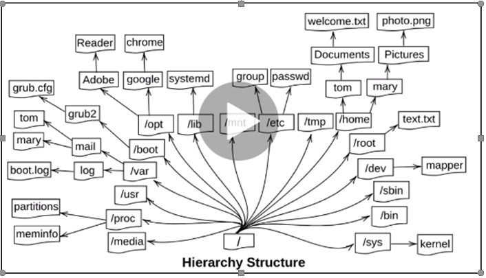

# About Redhat Linux Overview:

Redhat is a popular Operating system which is world widely used by 37% of people in Linux families.

Popular OS’s: CentOS, Ubuntu, Kali Linux, Suse linux, Fedora, Redhat.

GO to the https://access.redhat.com/front and download the ISO from downloads. If you don’t register in portal register there.Or else you can use the centos also instead of redhat for learning purpose.

Oracle virtual Box is a best platform to practise and learning linux.

We can easily access linux machine through command line and effectivetly complete our tasks through command line.

Directory Architecture:

