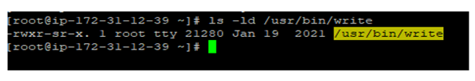
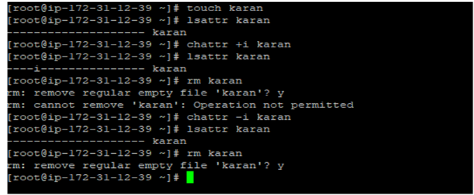

# Control Files using ACL: 

It is a more flexible way to handle file system, Which is very useful mechanism. We can give the read and write access for particular users for particular file.

Commands :

1. To add permission for a user: setfacl -m u:user:rwx (file path)  Ex: setfacl -m u:bala:rwx /tmp/bala.txt
2. To add permission to a group: setfacl -m g:group:rw (file path)  Ex: setfacl -m g:bala:rw /tmp/bala.txt
3. Inherit permissions for a directory: setfacl -Rm “entry” (folder path)
4. To remove particular entry for a specific user : setfacl -x u:user (file path)  Ex: setfacl -x u:bala:rwx /tmp/bala.txt
5. To remove all entries : setfacl -b (file path)
6. To check the ACL entries for a file : getfacl (file path)

Note: We can see a + symbol, If we add a ACl for a file and w permission doesn’t allows to delete a file for that user.

# Umask Value:

1. umask is the default permission for the files. Default value linux os is 0022.
2. first digit is used for special permissions.
3. second digit is : permission set for user.
4. third digit is: permission set for group.
5. fourth digit is: permission set for others.

Umask Commands:

1. To display the default umask of the system : umask
2. To display the umask in symbolic sign : umask -S
3. To change the umask value : umask 0026
4. Default umask for root : 0022
5. Default umask for other users : 0002
6. default umask permission for dir : 777
7. default umask permission for file : 666

Root umask calculation:

1. Default umask : 0022
2. Default dir permission : 755
3. Default file perm : 644
	        
Ordinary user umask calculation:

1. Default umask : 0002
2. Default dir permission : 777-002=775
3. Default file perm : 666-002 = 664

Important note : Once we change the umask value, it will be applicable for the current session only, if you reboot the system it will change into default umask, for permanent change edit the file ~/.bashrc (or) /etc/profile

Before change the umask value:

After change the umask value:

# Three Special File Persmissions:

1. In Linux three special permissions. (setuid, setgid, sticky bit).
2. This special permission used for executable files, the main reason is ordinary users also access executable the files, without help of the root user.

Permission tabular column:

Setuid bit:

Setuid used to run the executable files ordinary user also.

Example: chmod u+s (filename) Note: In Linux the following files are there. /bin/passwd & /usr/bin/su

concept: The root user allows to run the files to other user also. Hint: the set user id ignored in bash scripting files for security reasons. Just imagine, we want to run the very important bash scripting file that can change the configuration of kernel then the system is going to ignore the Setuid.

Setgid bit:

Same as setuid it is for group level,Run the ordinary users in the group to run the executable files.

Example: chmod g+s (filename) Note: In Linux the following files are there. /usr/bin/write

Sticky bit: 

Prevent anyone on the system to remove or modify the file except owner or root.  

Example: chmod o+t (filenam)  Note: Very good permission especially for shared directories.

Explanation all three permissions:

# File Attributes:

1. In Linux some special permissions are there to assign the files and directories used to prevent the files deletion, modification from other users.(even root also)
2. Example: chattr {options} {attributes} {filename}  :  Used to change the file or directory attribute.  Example: lsattr (filename) : Used to display the file attributes.
3. sample attributes: a --- append attribute used to prevent the adding the content in file.  i ---- immutable attribute used to prevent the delete file from users.
4. Using + adding attribute, Using – removing attributes.
5. command : a) chattr +a {filename}    b) chattr +i {filename}  c) chattr -a {filename}

