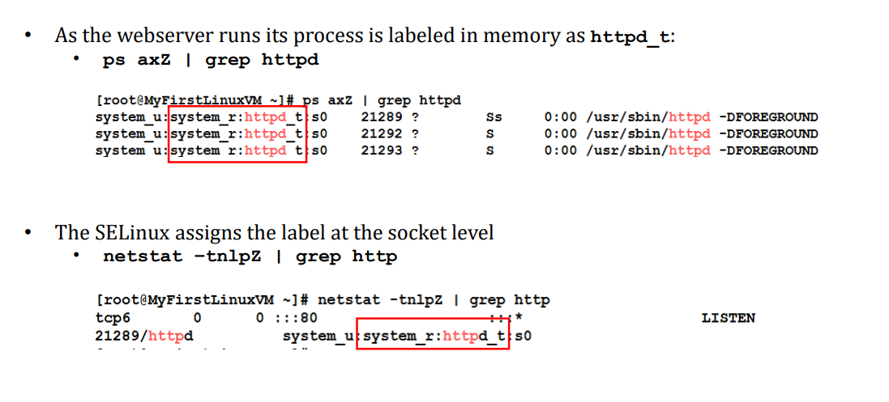

# Selinux:

Selinux full form is Enhanced security linux is a linux kernel security module that provides access control and security policies. It is a project of National security agency and Selinux Community.

Selinux Options:

1. Enforcing : By default it is on state while install OS and most of users disable this option.
2. Permissive:  Disabled but logs the activity.
3. Disable: Disabled and not activity logs.
4. sestatus or getenforce: Which is used to check the selinux status.
5. Selinux Setting : 1. setenforce 0 ---- Permissive or Disable.  2. setenforce 1 -----enable.
6. For Permanent Setting : /etc/selinux/config   1. selinux=enforcing and selinux=disabled.
7. Create a file /.autorelabel (File shoule be created before reboot the system)

Note: We must take a snapshot of the system which you want to play with Selinux.

Selinux comes with two major parts, labeling and enforcement and it has 4 different levels (user:role:type:level), Details mentioned in the below screenshot.

A webserver runs it process labeled in the memory with Selinux, We can see that label in ps command also.

Command : ps axZ | grep httpd

Selinux Assign the label at the socket level.

netstat -tnlpZ |grep http

(Screenshot mentioned but marked wrong place, He should mark the type only but added a part of role also but the command is  same)

Semanage command will play majorly to manage label and change the label for these below.

1. Login
2. user
3. port
4. interface
5. module
6. node
7. file context
8. boolean
9. permissive state
10. dontaudit

Note: Boolean only most of them use in Selinux.

Boolean:

1. Boolean is a on/off switch and it has predefined rules comes with Selinux. Ex: Do we allow FTP server to access  home directories & Can httpd talk ldap etc…
2. To get list of booleans: A)getsebool -a B)semanage boolean -l
3. To enable or turn on a boolean. Command : setsebool -P boolean_name on  (Instead off boolean name we use anyone of boolean which is listed in 2nd command)
4. Check error  message : journalctl
5. To change the  type in Boolean: A)chcon -t httpd_sys_content_t FILENAME B)semanage -t httpd_sys_content_t FILENAME

