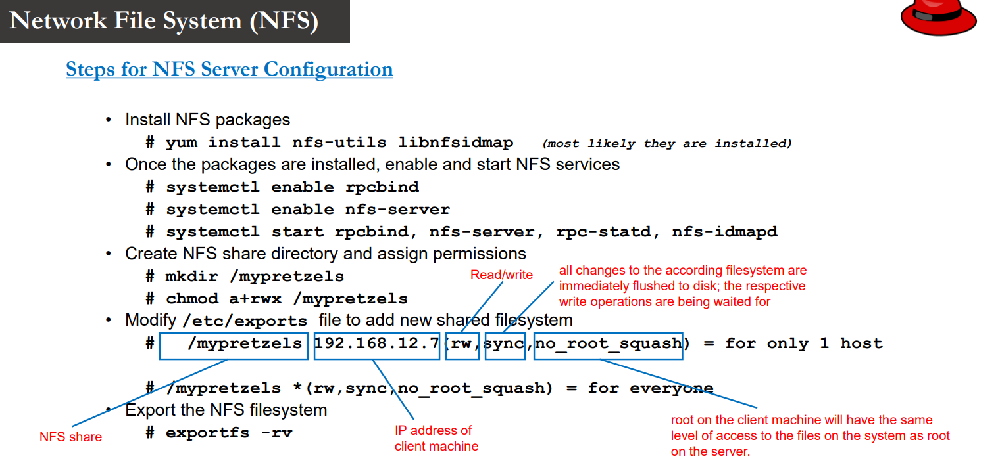
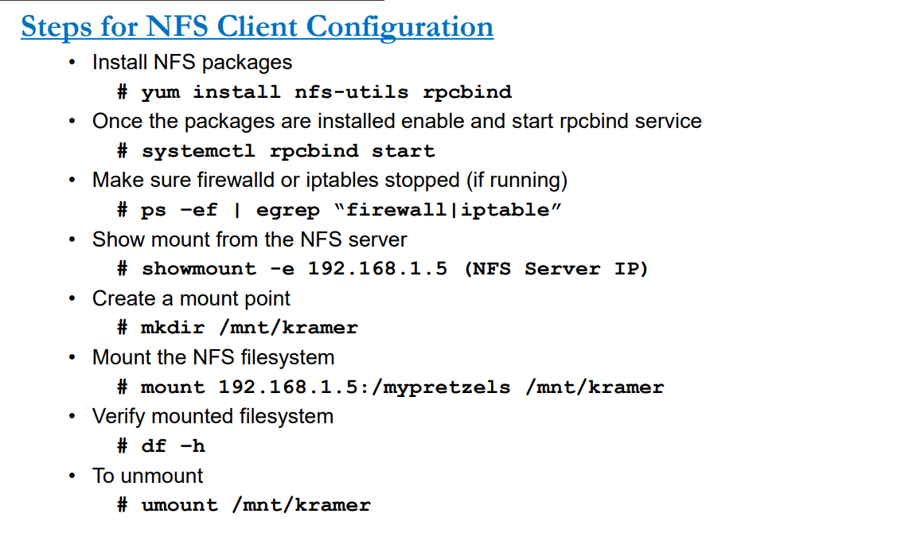

# NFS : Network file system.

NFS : Networks which helps to share a file system or a directory among other computers in same network.

NFS Server Configuration Steps:

NFS Clinet Configuration Steps:

# SAMBA Share:

Samba is a Linux tool or utility that allows sharing for Linux resources such as files and printers to with other operating systems. It works exactly like NFS but the difference is NFS shares within Linux or Unix like system whereas Samba shares with other OS (e.g. Windows, MAC etc.)

Samba vs CIFS:

Steps to configure samba server:

1. Take the snapshot of my vm.  
2. Go to Root.
3. yum install smaba samba-client samba-common 
4. firewall-cmd --permanent --zone=public --add service=samba and reload firewall-cmd --reload
5. If you don’t require firewall stop and disable using systemctl & IP tables too if yes. 
6. Create a dir: mkdir -p /samba/morepretzels
7. Set the perm : chmod a+rwx /samba/morepretzels
8. chown -R nobody:nobody /samba/morepretzels & chown -R nobody:nobody /samba
9. chcon -t samba_share_t /samba/morepretzels : If you are using selinux.
10. Don’t require disable it and reboot the server.
11. Go to the /etc/samba/smb.conf ( Remove all the lines and Add the below lines)

[global]

 	workgroup = WORKGROUP

    netbios name = centos
    
    security = user
    
    map to guest = bad user
    
    dns proxy = no

[Anonymous]
    
    path = /samba/morepretzels
    
    browsable = yes
    
    writable = yes
    
    guest ok = yes
    
    guest only = yes
    
    read only = no

(In the 11 th Steps Anonymous is a share path name.)

12. enable and start the services smb & nmb using systemctl.
13. Go to the windows machine and type \\192.168.1.95 : It will display the share path name and create a test file and check the access.
14. For linux : yum install -y cifs-utils samba-client & mkdir /mnt/sambashare & mount -t cifs //192.168.1.95/Anonymous /mnt/sambashare

# Secure Samba Access:

1. Create a group smbgrp & user larry to access the samba server with proper Authentication.
2. useradd larry
3. groupadd smbgrp
4. usermod -a -G smbgrp larry
5. smbpasswd -a larry

New SMB password: YOUR SAMBA PASS

Retype new SMB password: REPEAT YOUR SAMBA PASS

Added user larry  

6. Create a new share, set the permission on the share: mkdir /samba/securepretzels
7. chown -R larry:smbgrp /samba/securepretzels
8. chmod -R 0770 /samba/securepretzels
9. chcon -t samba_share_t /samba/securepretzels
10. Edit the configuration file /etc/samba/smb.conf (Create a backup copy first)

vi /etc/samba/smb.conf

Add the following lines

[Secure]
    
    path = /samba/securepretzels
    
    valid users = @smbgrp
    
    guest ok = no
    
    writable = yes
    
    browsable = yes

11. Restart the services systemctl restart smb & systemctl restart nmb

