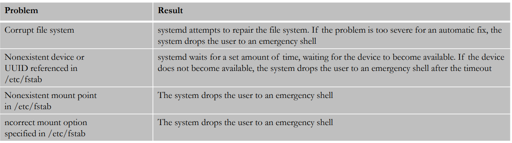

# Linux Boot Process:

1. Boot Sequence Centos 7 & above is different.
2. systemd is a new service manager which replaces the init.d 
3. Must require the Boot process to trouble shoot.

# Explanation Diagram:

1. Systemd is the first process of the OS and it decides which run level the OS needs to be in.
2. These run levels as many target.

3. To view the current target : systemctl get-default  & who -r
4. Each target dependence on another target ( Ex. Graphical target refers mutli user target)
5. To view the dependencies of target : systemctl list-dependencies graphical.target | grep target( Which list out all the targets)  
6. View all run levels by issue the command : ls -l /lib/systemd/system/runlevel*
7. systemctl set-default graphical.target : For setting the default target
8. systemctl set-default multi-user.target : To change the target but should reboot the machine.
9. After Reboot double check the by run the command: systemctl get-deafult

# Recover Root pass:

1. Restart the machine, Choose the first kernel
2. Press e (Or) Shift + e ,Search the line vmlinux16 
3. Remove the word ro and put the rw=init=/sysroot/bin/sh, Press Ctrl +x
4. Run the command : chroot /sysroot
5. Run the comm : passwd root 
6. Run the comm: touch /.autorelabel
7. Run command : exit 
8. Reboot

# Repair filesystem:

1. If we make any mistakes in /etc partition and disk level corruption system doesn’t boot and it went to emergency mode.   

2. And also make sure to maintain the fstab also to avoid emergancy mode.

# Different Run levels:

Run levels are used to how our system state will boot, Most of the linux servers in runlevel3 and runlevel5 only.

1. 0 : System halt i.e., the system can be safely powered off with no activity.
2. 1 : Single user mode.
3. 2 : Multiple user mode with no NFS (network file system).
4. 3 : Multiple user modes under the command line interface and not under the graphical user interface.
5. 4 : User-definable.
6. 5 : Multiple user mode under GUI (graphical user interface) and this is the standard runlevel for most of the LINUX-based systems.
7. 6 : Reboot which is used to restart the system.

# Modifying grub boot loader:

grub files are used to change the grep level parameter during boot time.

1. Grub boot loader files: cat /etc/default/grub and /etc/grub2/grub.cfg
2. The above mentioned first file will reflect into the second file.
3. Always we edit the first file only, For example we can change the from GRUB_TIMEOUT=2 to GRUB_TIMEOUT=5 at the boot time we can manually choose the grub.
4. After change the modification run the command: grub2-mkconfig -o /boot/grub2/grub.cfg  After that it will show the output done.

