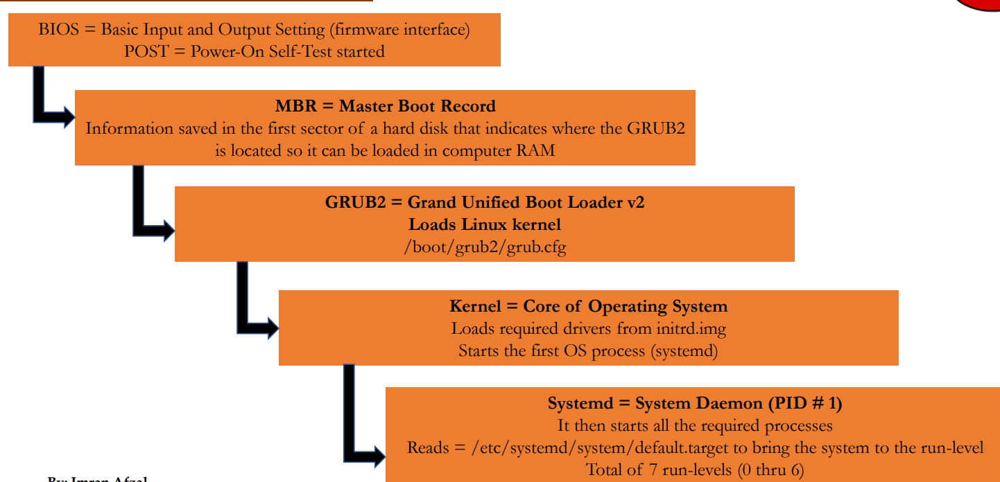
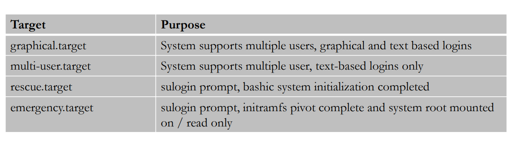

# Linux Boot Process:

1. Boot Sequence Centos 7 & above is different.
2. systemd is a new service manager which replaces the init.d 
3. Must require the Boot process to trouble shoot.

# Explanation Diagram:

1. Systemd is the first process of the OS and it decides which run level the OS needs to be in.
2. These run levels as many target.

3. To view the current target : systemctl get-default  & who -r
4. Each target dependence on another target ( Ex. Graphical target refers mutli user target)
5. To view the dependencies of target : systemctl list-dependencies graphical.target | grep target( Which list out all the targets)  
6. View all run levels by issue the command : ls -l /lib/systemd/system/runlevel*
7. systemctl set-default graphical.target : For setting the default target
8. systemctl set-default multi-user.target : To change the target but should reboot the machine.
9. After Reboot double check the by run the command: systemctl get-deafult

# Recover Root pass:

1. Restart the machine, Choose the first kernel
2. Press e (Or) Shift + e ,Search the line vmlinux16 
3. Remove the word ro and put the rw=init=/sysroot/bin/sh, Press Ctrl +x
4. Run the command : chroot /sysroot
5. Run the comm : passwd root 
6. Run the comm: touch /.autorelabel
7. Run command : exit 
8. Reboot

# Repair filesystem:

1. If we make any mistakes in /etc partition and disk level corruption system doesn’t boot and it went to emergency mode.   

2. And also make sure to maintain the fstab also to avoid emergancy mode.
