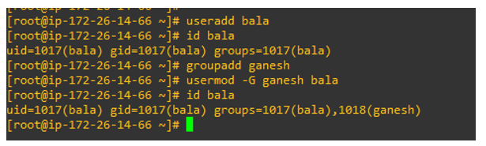
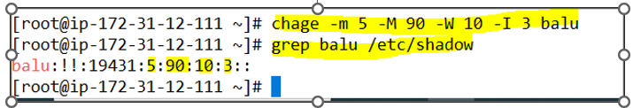
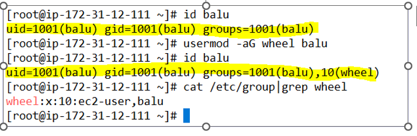

# User Management commands and group management command:

When we enter into usernamd group management the following files to remember : /etc/shadow /etc/passwd /etc/group

user add command : useradd (name of the user) Ex: useradd bala 

group add command: groupadd (name of the user) Ex: groupadd admins

you can verify using run the command : id bala

group add command : groupadd (name of the group) Ex: groupadd ganesh  

you can verify using run the command : cat /etc/group

Delete a user command : userdel -r (username)  Ex: userdel -r bala

Delete a group command : groupdel  (groupname)  Ex: groupdel ganesh

Add the user into another group user the screenshot mentioned commands:

We must aware and know the each field explanations of shadow and passwd and group file.

The single command uses in corporate environment: useradd -g ganesh -s /bin/bash -c “tech boy” -m -d /home/bala bala

To remove a user from group : gpasswd --delete username groupname.

# Password Aging enable:

Conf file : /etc/login.defs

Command : chage -m 5 -M 90 -W 10 -I 3 balu

command to check the user password age:  chage -l <username>

Explanation: m --- Minum age M ---Maximum age -W -----warning pop up I ---- disable account after three days

# Switch user and Sudo access files:

We can give permissions using /etc/sudoers and visudo but /etc/sudoers is dangerous it doesn't check and syntax and errors better to go with visudo command

Commands

1) To enter into the sudoers file: visudo 

2) Execute a command: sudo <command>

3) Switch user: su - username

4) Conf file name: /etc/sudoers

5) Command to provide sudo access: usermod -aG wheel balu

Wheel is a default group in linux(centos) to enable sudo access.

