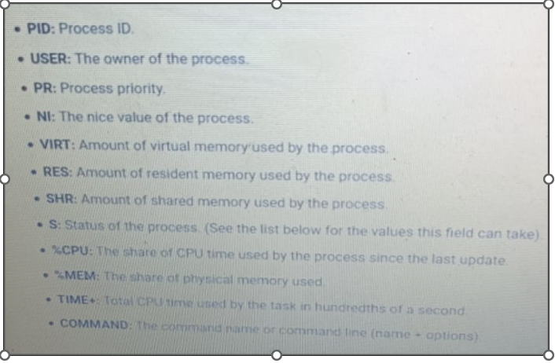

# Terms Explanations:

Applications : Windows: PowerPoint, Excel.  Linux : NTP and Apache

Scripts: Lists of commands in a file something execute or automate something.

Process: Processes will create when we start a application and it creates a process id too.

Daemon : It is also type of process and it’s continuously running on background.

Thread : Every Process has multiple thread and associated with it.

Job : It is nothing but like a scheduler and we can easily schedule it.

df -h or df -Th : which is used to find out the file system space in linux server.
   
Tmpfs partitions: These are related to the swap space of our OS.

du -hs : It uses to list the files and directoies sizes.  Example: du -hs /home

uptime : Which helps to check the mail server running time.

Top : Used to list of process in system and it’s utilization.

# TOP explanations:

free -m and free -h : These commands are used to find out the RAM allocated to the particular machine.

lsof : which helps to list of open files in a machine. 

tcpdump -i enp0s3 : It uses to monitor network traffic for a particular interface.

netstat -rnv : Which helps to list interfaces, gateways and subnet mask and how inerfaces connecting with internet.

netstat -anp : Which is used to list services and listening ports.

ps -ef (or) ps -aux : It is used to list the list of process in our OS.

kill (process id) : Used to kill a process.

kill -9 (Process id) : Used to force kill a process. 

# Control Services and Daemons(Systemctl):

Service or App when it starts it will create a process and its running continuously in Back end.

systemctl command is used to manage the services and earlier version we used /etc/init.d/

Commands:

systemctl --version : Which helps to check the version. 

systemctl --all  : It helps to list out all services running on our system.

systemctl start/stop/restart firewalld : It helps to start, stop and restrat services.

systemctl reload firewalld : It doesn’t affect the production, Just it gives the updated configurations info to the service.  

systemctl enable firewalld : It helps to start the service when the system Rebooting. 

systemctl mask firewalld :  Nobody can start the service manually and it doesn’t strat during the boot time also, We should do the unmak if we are going to start.

rpm -qa|wc -l : List of packages installed in our system

# SSH Service Stuffs:

Secure Shell access is a full from of SSH , However we can configure some additional stuffs also to secure it more.

We must set the timed out values for security purpose:

ClientAliveInterval 600
ClientAliveCountMax 0

If we add the above setting and restart the sshd, So if anyone not interact with the session more than 600 seconds, They will automatically kick out from the session.

And then disable root ssh access by adding this line, If already line present just change it into no. And should restart the sshd service.

PermitRootLogin no

We should force the users to login with the password for that we must enable option empty password no option.

PermitEmptyPasswords no

Add the line in the sshd.config file, If already line is present check whether it is uncomment, If not please do it and restart sshd.

We can restirct the users and give the permission to certain users only for ssh login by adding those users in sshd config file.

AllowUsers user2 user3

In this above scenrio user2 and user3 only can take take ssh other users cannot.

We can change the SSH port um also by editing the sshd config file.

Port 7676

If already line is present just uncomment and change the port number, and restart the service.

# SSH Keygen & Login through an ssh key without password:

Reasons : 1. Automations. 2. Recitative logins avoiding.

Example : 

1. You are going login the 1.3 server from 1.2 server without a password, So you first run these commands in 1.2 server.

2. ssh-keygen(press three times enter)

3. ssh-copy-id root@192.168.1.3 ( it will ask the password for 1.3, Please give it)

4. Again take the ssh to the server. ssh root@192.168.1.2 ( it will just login without a password)
