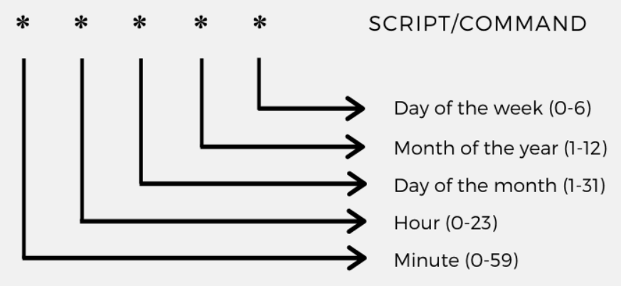
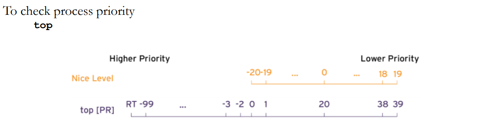

# Cron:

Cron used to create auto job schedule and it is very easy to handle.

22 13 * 3 * echo “ This is my first Cron entry” > cron.entry

It creates file cron.entry.

# Tune System Performance:

TUNED:

Tuning is a system fine tune service, it is installed in Centos and Redhat by default. Tuned package name is tuned. Tuned comes with default seeting once we adjust it, it manages network performance and read and write I/O.

Many tuned options available like throughput, network, powersave and oracle etc.. Install : yum install tuned and using the systemctl start,stop and enable.

1. To check the current tuned profile : tuned-adm active
2. To list out : tuned-adm list
3. To change the setting to daemon use the command : tuned-adm
4. To change the profile : tuned-adm profile active
5. To check the system recommendation : tuned-adm recommend
6. To turn off tuned : tuned-adm off

We can change the profile through an GUI also by using cockpit. 192.168.1.10:9090

Nice AND RENICE:

Using nice and renice command, We can give the priority to the particular task and it has 40 different levels.

Process priority can be viewed through ps command as well with the right options : ps axo pid,comm,nice,cls --sort=-nice

To set the process priority:  nice –n -15 top

To change the process priority: renice –n 12 PID

While we use the renice we must use  the process id and doesn’t stop the service.

# GREP:

1. Global regular expression print : grep
2. grep -c keyword filename : It counts numbers of times particular word in the file.
3. grep -n keyword filename : Display the matched lines and their line numbers
4. grep -v keyword filename :  It displays the lines which is not matching in the particular keyword.
5. grep -i bala bala.txt| awk ‘{print $1}’|cut -c1-c3 : Cut first portion of the file.
6. We can use the egrep to search two keywords in a time : egrep -i “seinfie|costan” bala.txt

# SHELL AND SHELL SCRIPTING:

It is like a container and talks between users and kernel. 

1. To find our shell: echo $0 
2. Available shell : cat /etc/shells
3. Find out the particular user shell: We can look at the /etc/passwd

Basics of shell scripting: 

1. All scripts should be start with the line #! /bin/bash  We can run the script ./bala.bash
2. echo gives a empty line in a output. We just use the echo word only.
3. Define variable : a= bala
4. If we are getting input from user, We can use read word in the script.
5. We must include ~ symbol while add the command in the scripts.
6. For loop statement : for i in jump run play

# Find Command:

Find command used to find out files and search something in particular directory.

1. It will display all files in your currect directory : find . -type f
2. It will display all files in your /home directory : find /home -type d
3. It will display the text files in your current directory : find . -name “*.txt” 
4. It will display the folder name created in bala both upper case and lower case which is present in current directory : find . -iname bala
5. It will delete the folder name present in bala in your current directory : find . -iname bala -delete 
6. It will display the files present in /home more than 20MB :	find /home -size 20M 
7. It will display the file names under the /home directory which contains the 666 : find /home -type f -perm 0666
8. It will display the all directory belonging to the user bala : find /home -type d -user bala 
9. It will display the all directory belonging to the group bala : find /home -type d -group bala 
10. Used to display the April word present in the current directory :  find /home -type f -iname “*.txt” -exec grep ‘April’ {} \;
11. It is used to copy the all text file in your current directory to /root/ganesh : find . -type f -iname “*.txt” -exec cp {} /root/ganesh \;
12.	Used to delete the all txt files in your current directory : find . -iname “.txt” -exec rm -rf {} \;
